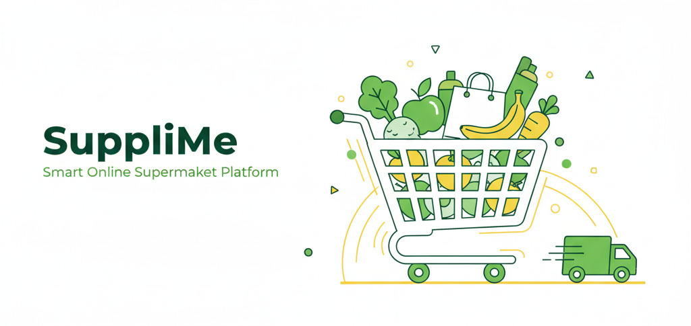

## 🛒 SuppliMe
<p align="center">
  
</p>


**SuppliMe** is a smart and modern **online supermarket platform** designed to make grocery shopping easier, faster, and more enjoyable for everyone.  

SuppliMe delivers a seamless e-commerce experience built with a focus on **usability**, **efficiency**, and **real-world reliability**.  

### 💡 The Platform Has Three Main Modules:

- 👤 **User Module:**  
  Allows customers to explore categories, add items to their cart, place orders, and make secure payments.  
  Users can also track their orders, receive notifications, and enjoy a smooth, intuitive shopping experience.

- 🧑‍💼 **Admin Module:**  
  Enables administrators to manage products, categories, users, and orders through a powerful and organized dashboard.  
  Admins can monitor and ensure all operations run efficiently.

- 🚚 **Delivery Module:**  
  Gives delivery staff their own panel to view assigned orders, update delivery statuses  
  and manage tasks easily — ensuring fast and transparent delivery tracking for users.

> 🌟 With **SuppliMe**, online shopping becomes simpler, faster, and smarter — bringing the supermarket experience right to your fingertips.


---
### 🧩 Tech Stack

<p align="center">
  
  
  
  
  
  
  
  
  
</p>

---

### 🚀 Features

- 🛍️ **User-friendly shopping experience** — browse categories, add products to cart, and checkout easily.  
- 💳 **payment system** — supports multiple payment methods.  
- 📦 **Order management** — track your orders, view details, and receive notifications.  
- 👩‍💼 **Admin panel** — manage products, categories, and users.  
- 🚚 **Delivery panel** — delivery staff can view assigned orders, update delivery status , and manage their tasks efficiently.
- 🌍 **Governorate-based shipping cost** calculation.  


---


## ⚙️ Installation

Follow these steps to set up **SuppliMe** locally:

1. **Clone the repository**
   ```bash
   git clone https://github.com/Menna-Baligh/SuppliMe.git
   ```

2. **Navigate to the project directory**
   ```bash
   cd SuppliMe
   ```

3. **Install backend dependencies**
   ```bash
   composer install
   ```

4. **Install frontend dependencies**
   ```bash
   npm install
   ```

5. **Copy the example environment file**
   ```bash
   cp .env.example .env
   ```
   - Update your **database credentials**
   - Set `APP_URL=http://localhost:8000`

6. **Generate the application key**
   ```bash
   php artisan key:generate
   ```

7. **Run migrations**
   ```bash
   php artisan migrate 
   ```

8. **Start the development server**
   ```bash
   php artisan serve
   ```

9. **Access the app**
   - User interface → `http://127.0.0.1:8000`
   - Admin panel → `http://127.0.0.1:8000/admin`
   - Delivery panel → `http://127.0.0.1:8000/delivery`


---

## 👩‍💻 Team

> This project was developed as part of the **Software Engineering Course** at  
> **Faculty of Computer and Information Sciences, Mansoura University** 🏫

| Name | Role | GitHub |
|------|------|--------|
| Menna Baligh | Backend Developer | [visit](https://github.com/Menna-Baligh) |
| Hagar Elbakry | Backend Developer | [visit](https://github.com/Hagar-Elbakry) |
| Menna Hamada | Frontend Developer | [visit](https://github.com/MennaHamadaElsba3i) |
| Menna Elsayed | UI/UX Designer | [visit](https://github.com/Mennaelsayd55) |

---


## 📊 Presentation & Documentation

📎 [View Full Project Presentation (UML, BMC, Competitors, and more)](https://www.canva.com/design/DAGYiyVoYR4/yqPynpzQwpaaIgphqATE3w/edit?utm_content=DAGYiyVoYR4&utm_campaign=designshare&utm_medium=link2&utm_source=sharebutton)

---
>  Built with Passion by the SuppliMe Team 💚


